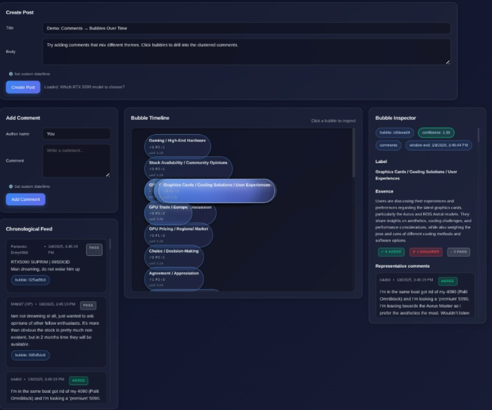

<p align="center">
  
</p>

# Comment Bubbles MVP

Real-time comment clustering into semantic "bubbles" with AI-powered labeling, voting, and temporal visualization. Works **with or without** an OpenAI API key.

## Quick Start

```bash
make run
```

That's it. This creates a virtualenv, installs deps, loads sample data (a Reddit thread), and opens at **http://127.0.0.1:8000**.

No API key needed — the app runs in **local mode** using sentence-transformers for embeddings and VADER for sentiment analysis.

### With OpenAI (full features + chat)

```bash
echo "GPT_KEY=sk-..." > .env
make run
```

LLM mode uses OpenAI `text-embedding-3-small` for embeddings, GPT-4o-mini for labeling/voting, and enables a chat interface to ask questions about the conversation.

## Features

- **Real-time clustering**: Comments grouped into semantic bubbles as they arrive
- **Dual mode**: GPT-powered (OpenAI) or fully local (sentence-transformers + VADER)
- **Temporal visualization**: Interactive timeline showing bubble evolution over time
- **Voting classification**: Each comment classified as "agree", "disagree", or "pass"
- **Chat** (LLM mode): Ask questions about the conversation — all comments hot-loaded into context
- **Reddit import**: Import Reddit threads from text files
- **Evaluation system**: Detailed analysis of clustering decisions with metrics

## How It Works

```
Comment → Embed → Cluster (cosine similarity) → Label → Vote → Visualize
```

1. **Embed**: Each comment is converted to a vector (OpenAI `text-embedding-3-small` or local `all-MiniLM-L6-v2`)
2. **Cluster**: Online incremental clustering assigns comments to existing bubbles or creates new ones
3. **Label**: Each bubble gets a 2-4 word label and 1-2 sentence essence (GPT or keyword extraction)
4. **Vote**: Comments classified as agree/disagree/pass relative to the post (GPT or VADER sentiment)
5. **Visualize**: Interactive timeline with lane-based layout, size encoding, and vote summaries

## Modes

| | LLM Mode (`GPT_KEY` set) | Local Mode (no key) |
|---|---|---|
| Embeddings | OpenAI `text-embedding-3-small` (1536d) | `all-MiniLM-L6-v2` (384d) |
| Labeling | GPT-4o-mini | Keyword extraction |
| Voting | GPT-4o-mini (stance detection) | VADER (sentiment polarity) |
| Chat | Available | Hidden |
| Clustering threshold | 0.58 | 0.45 |

## API Endpoints

### Posts
- `GET /api/posts/list` — List all posts
- `POST /api/posts` — Create a new post
- `GET /api/posts/{post_id}/state` — Get full state
- `POST /api/posts/{post_id}/load` — Set as current post
- `GET /api/current-state` — Get current post state
- `GET /api/posts/{post_id}/evaluate` — Clustering evaluation report

### Comments
- `POST /api/posts/{post_id}/comments` — Add a comment

### Chat (LLM mode only)
- `POST /api/posts/{post_id}/chat` — Ask a question about the conversation

### Config
- `GET /api/config` — Current mode, model, threshold

## Project Structure

```
bubblers/
├── app/
│   ├── main.py                # FastAPI app, lifespan, chat endpoint
│   ├── models.py              # Pydantic data models
│   ├── store.py               # In-memory data store
│   ├── utils.py               # Utility functions
│   ├── metrics.py             # Clustering metrics
│   ├── evaluation.py          # Detailed evaluation system
│   ├── reddit_parser.py       # Reddit thread parser
│   ├── pipeline/
│   │   ├── orchestrator.py    # Pipeline coordinator (mode detection)
│   │   ├── providers.py       # Abstract base classes
│   │   ├── embedding.py       # GPT embedding provider
│   │   ├── local_embedding.py # sentence-transformers provider
│   │   ├── clusterer.py       # Online cosine-similarity clustering
│   │   ├── labeler.py         # GPT labeler
│   │   ├── local_labeler.py   # Keyword extraction labeler
│   │   ├── voter.py           # GPT voter
│   │   └── local_voter.py     # VADER sentiment voter
│   └── static/
│       ├── index.html
│       ├── app.js
│       └── styles.css
├── Makefile                   # One-command setup & run
├── tests.txt                  # Sample Reddit thread (auto-loaded)
└── requirements.txt
```

## Reddit Import

```bash
# Auto-loaded on startup from tests.txt
# Or manually:
python test_reddit_import.py tests.txt
python test_reddit_import_parallel.py tests.txt [batch_size]
```

## Evaluation

```bash
python evaluate_system.py <post_id> [threshold]
```

Analyzes clustering decisions, bubble cohesion, threshold tuning, and provides recommendations.

## Limitations

- **In-memory storage**: Data lost on server restart
- **Local mode voting**: VADER measures sentiment polarity, not stance relative to the post — results are approximate
- **No authentication**: All operations are open
- **Single-threaded**: Comments processed sequentially

## License

See project files for license information.
